基于SpringBoot的大学生选修选课系统（程序+论文）
=
- 完整代码获取地址：从戎源码网 ([https://armycodes.com/](https://armycodes.com/))
- 作者微信：19941326836  QQ：952045282 
- 承接计算机毕业设计、Java毕业设计、Python毕业设计、深度学习、机器学习
- 选题+开题报告+任务书+程序定制+安装调试+论文+答辩ppt 一条龙服务
- 所有选题地址https://github.com/nature924/allProject

一、项目介绍
---
基于Spring Boot框架实现的大学生选修选课系统，系统包含两种角色：管理员、教师、用户,系统分为前台和后台两大模块，主要功能如下。
### 前台功能：

1. 个人中心：学生可以在个人中心查看个人信息。
2. 课程信息管理：学生可以查看选修课程的相关信息。
3. 排课信息管理：学生可以查看选修课程的排课信息。
4. 选课信息管理：学生可以在选课系统中进行选课操作。
5. 学生成绩管理：学生可以查看已修课程的成绩。
6. 选课限制管理：学生可以查看选课限制。
7. 公告信息管理：学生可以查看选修课程及学校重要公告等信息。

### 后台功能：

### 管理员：

1. 个人中心：管理员可以管理个人信息。
2. 管理员管理：管理员可以管理系统管理员账号信息，包括添加、编辑、删除等操作。
3. 教师管理：管理员可以管理教师信息，包括添加、编辑、删除等操作。
4. 学生管理：管理员可以管理学生信息，包括添加、编辑、删除等操作。
5. 课程信息管理：管理员可以管理选修课程的信息，包括添加、编辑、删除等操作。
6. 排课信息管理：管理员可以管理选修课程的排课信息，包括添加、编辑、删除等操作。
7. 选课信息管理：管理员可以管理选课系统的相关信息，包括开放选课时间、选课规则等。
8. 学生成绩管理：管理员可以管理学生的成绩信息，包括查询、录入、修改等操作。
9. 基础数据管理：管理员可以管理系统的基础数据，包括用户信息、角色权限等。
10. 选课限制管理：管理员可以管理选课系统的限制信息，包括已选学分上限、课程选修顺序等。
11. 公告信息管理：管理员可以管理系统公告信息，包括添加、编辑、删除等操作。

### 教师：

1. 个人中心：教师可以管理个人信息。
2. 学生管理：教师可以管理所教授课程的学生信息，包括添加、编辑、删除等操作。
3. 课程信息管理：教师可以管理所教授课程的信息，包括添加、编辑、删除等操作。
4. 排课信息管理：教师可以管理所教授课程的排课信息，包括添加、编辑、删除等操作。
5. 选课信息管理：教师可以管理所教授课程的选课情况，包括查询、修改等操作。
6. 学生成绩管理：教师可以管理所教授课程的学生成绩，包括查询、录入、修改等操作。
7. 选课限制管理：教师可以查看选课限制，包括已选学分上限、课程选修顺序等。
8. 公告信息管理：教师可以查看选修课程及学校重要公告等信息。

二、项目技术
---
- 编程语言：Java
- 数据库：MySQL
- 项目管理工具：Maven
- 前端技术：VUE、HTML、Jquery、Bootstrap
- 后端技术：Spring、SpringMVC、MyBatis

三、运行环境
---
- 操作系统：Windows、macOS都可以
- JDK版本：JDK1.8以上都可以
- 开发工具：IDEA、Ecplise、Myecplise都可以
- 数据库: MySQL5.7以上都可以
- Tomcat：任意版本都可以
- Maven：任意版本都可以

四、运行截图
---
### 论文截图：
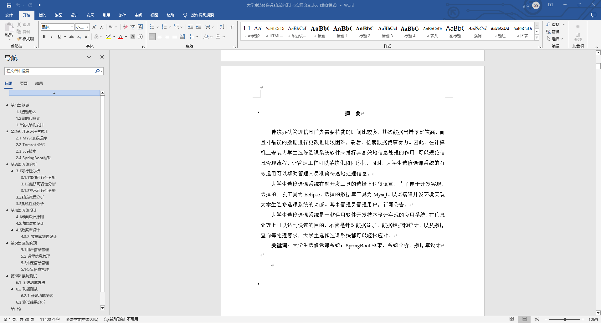
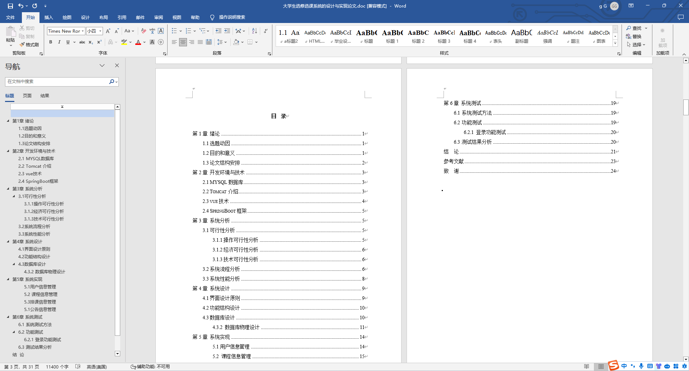

### 程序截图：
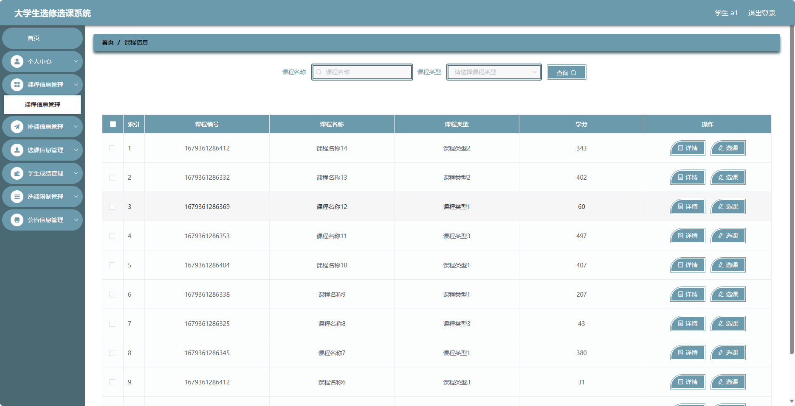
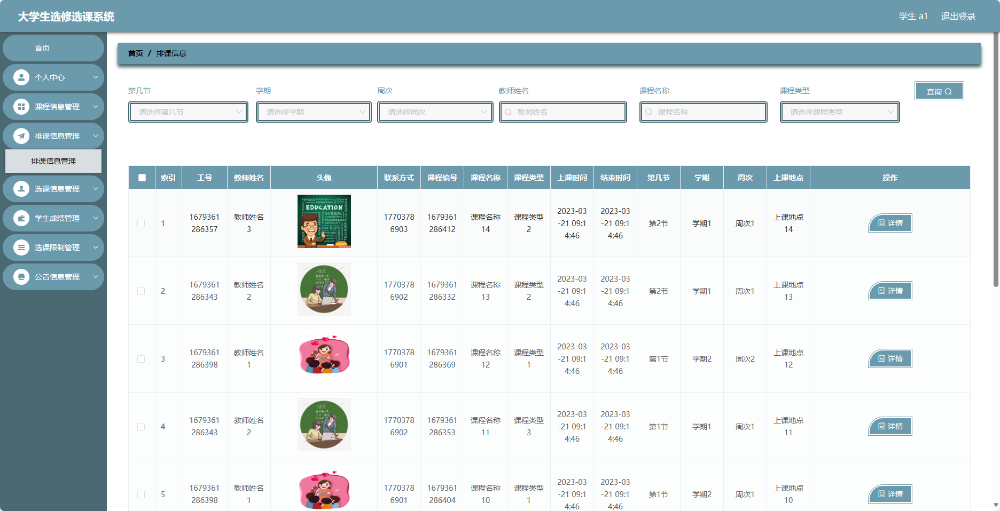
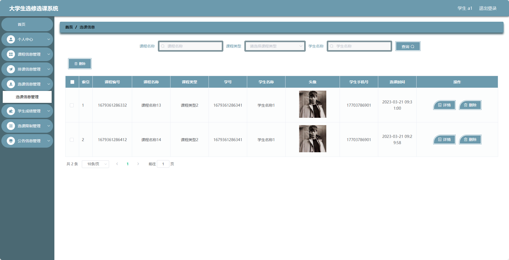
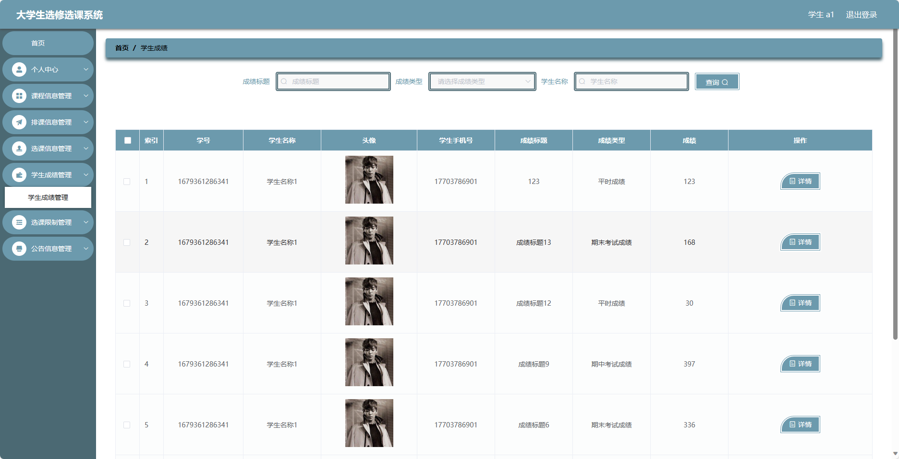
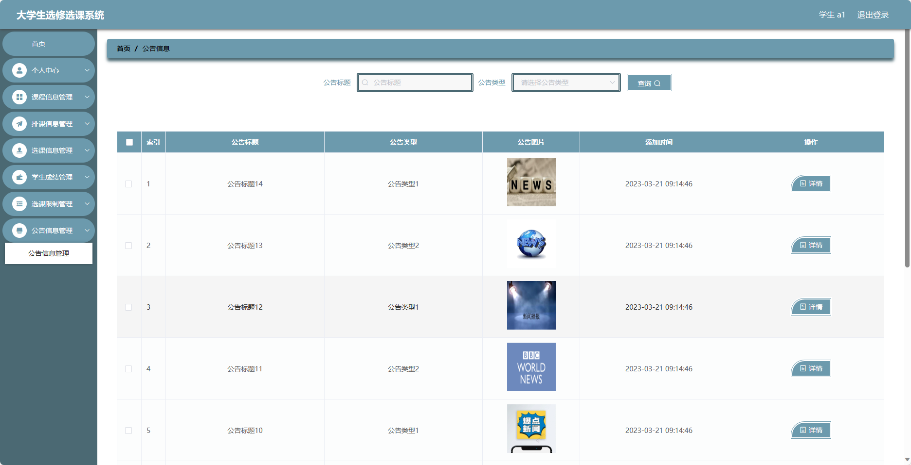
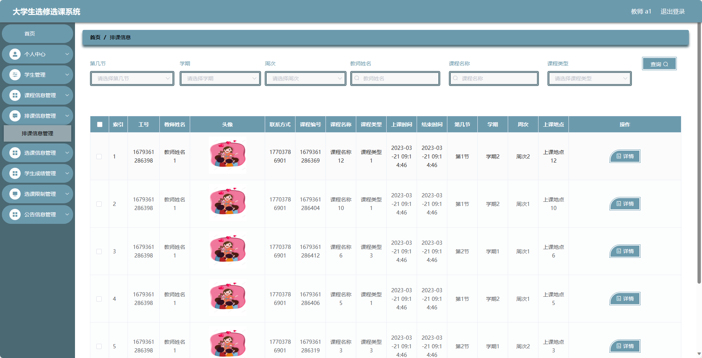
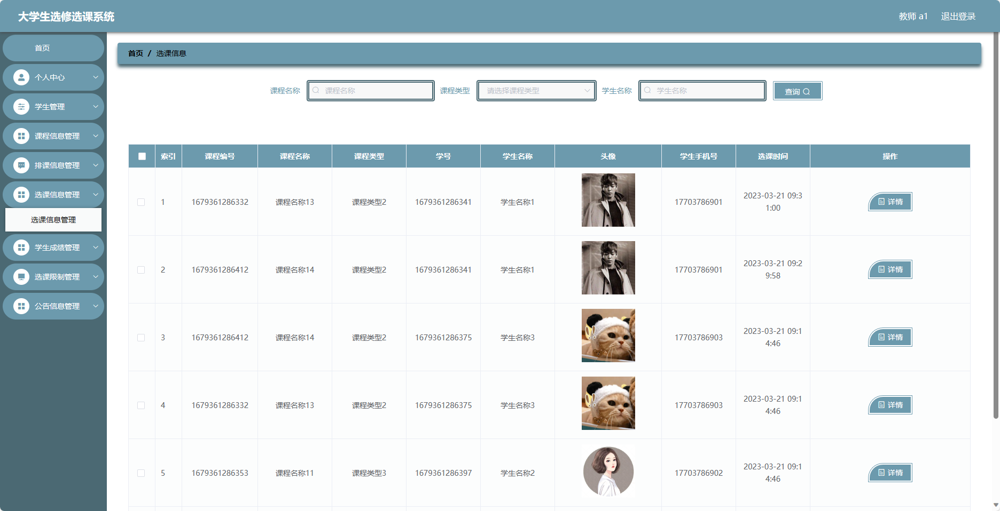
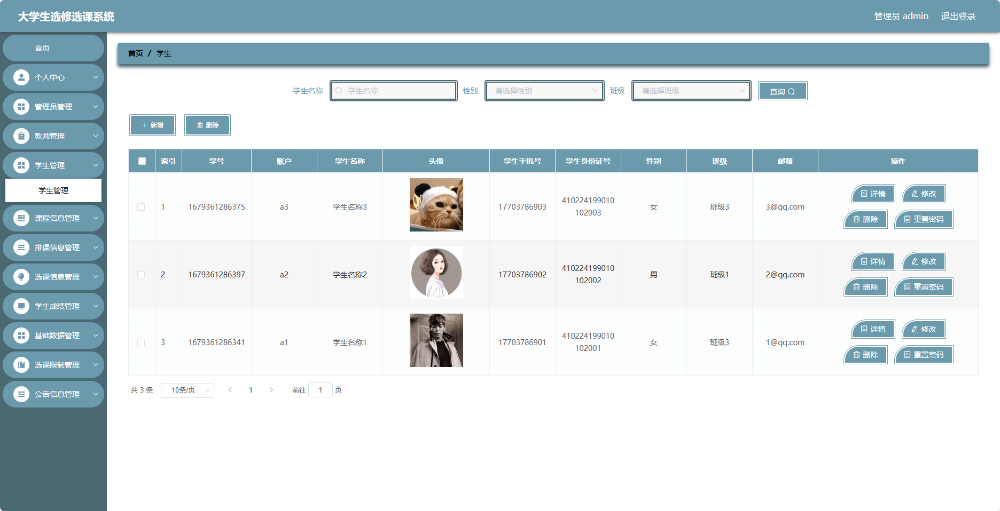
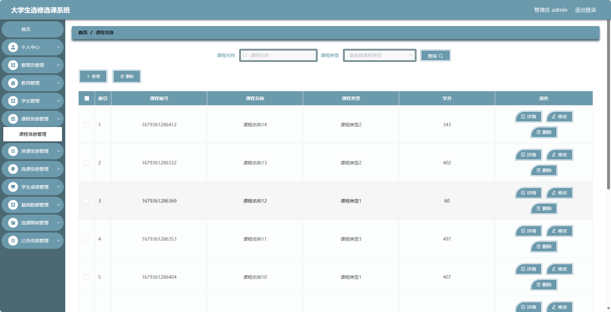

